# EmployeeAttendance Smart Contract *** ## Problem Statement Write a solidity code to mark attendance of employees. Once an employee enters a company premises his id is accessed through RFID tag and also when he exit from the company. Based on his workmanship an employee will be marked present(present for min 8hrs), absent (present for less than 1 hour) and half day present(present for less than 4hrs).  ## Output
### 1. Absent case scenario
#### Employee with RFID 100 before entering the company
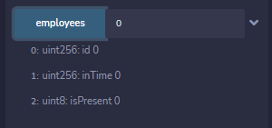
#### Employee with RFID 100 enters the company
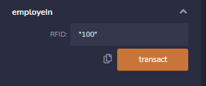
#### Checking whether the data is entered or not
Employee with RFID 100 entered the company at **timestamp 1641794287** unix style.\
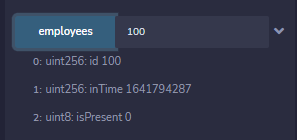
#### Employee with RFID 100 leaves the company
The employee leaves the company at timestamp 1641797100 unix style. We make a transaction on blockchain stating the given condition.\
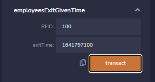
#### Smart contract computation result 
We check the presentee of employee on blockchain as computed by smart contract.\
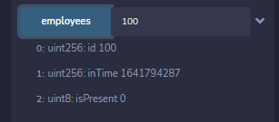
From the above image, we can see that *isPresent=0* which means that employee is *ABSENT*.
***
### 2. Half day case scenario
<!-- Second case scenario -->

#### Employee with RFID 200 before entering the company
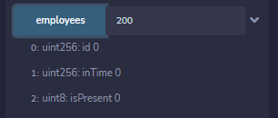\
Before entering the employee with RFID 200, there is no record on blockchain.\
#### Employee with RFID 200 enters the company
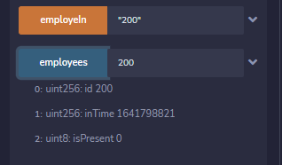
When an employee enters the company, RFID=200 is scanned and marked on the blockchain.\
#### Employee with RFID 200 leaves the company
The employee leaves the company at timestamp 1641804300 unix style. We make a transaction on blockchain stating the given condition.\
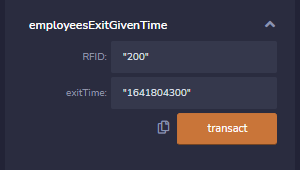
#### Smart contract computation result 
We check the presentee of employee on blockchain as computed by smart contract.\
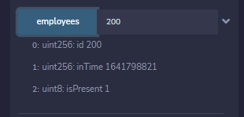
From the above image, we can see that *isPresent=1* which means that employee is *HALFDAY*.

***
<!-- Third case scenario -->
### 3. Present case scenario
#### Employee with RFID 300 before entering the company
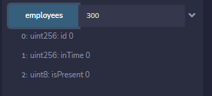
#### Employee with RFID 300 enters the company
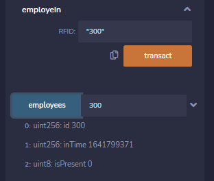
We can see that employee presentee is recorded on blockchain.
#### Employee with RFID 300 leaves the company
The employee leaves the company at timestamp 1641833100 unix style. We make a transaction on blockchain stating the given condition.\
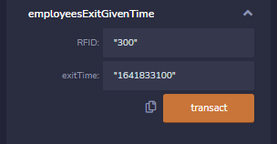
#### Smart contract computation result 
We check the presentee of employee on blockchain as computed by smart contract.\
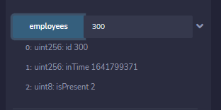\
From the above image, we can see that *isPresent=2* which means that employee is *PRESENT*.

***
## Resources
1. (UNIX Timestamp)[https://www.unixtimestamp.com/]
2. (Remix IDE)[https://remix.ethereum.org/]

***
*Author      : Ankur Wasnik
*Subject     : Blockchain Technology
*Last Edited : 10th Jan 2022
